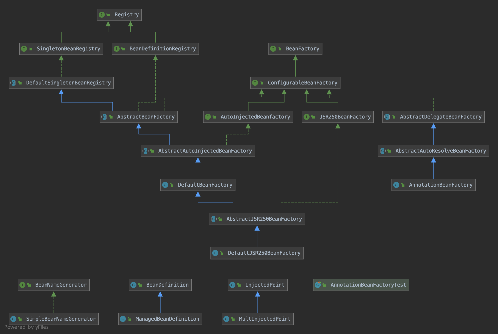
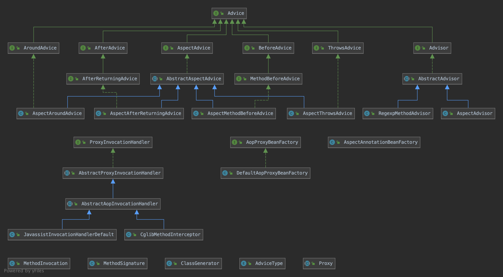
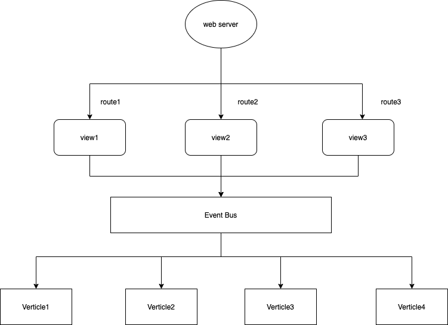

#### 自己动手实现的轻量级依赖注入框架V0.3版本

V0.3版本大量重构，对BeanFactory进行了抽象，使得项目结构更加合理。

该框架具有如下功能：
1. 可以通过注解标记组件类，被标记的类会被扫描并添加到容器中。
2. 解析组件类的依赖关系，进行依赖注入。
3. 解决组件类相互引用等异常情况。
4. 根据组件注解的描述信息，返回单例对象，或者返回新的对象。
5. 支持集合注入。
6. 支持Aspect注解实现AOP拦截。
7. 支持配置文件属性注入。
8. 对vertx进行封装，使用注解实现webserver。
9. 封装vertx的auth模块，实现权限管理功能。
10. 支持使用filter来拦截请求。

该框架实现了jsr330规范和jsr250规范，实现了基本的依赖注入功能。

core设计如下：

aop设计如下：

web设计如下：

#### 更新日志:

1. 去除了V0.2版本中的Spring注解，仅支持jsr330和jsr250注解
2. 重新设计了项目，尽可能的面向接口编程

##### todolist:
1. 参数注入
2. luncher封装
3. 缓存
4. 服务监控
5. verticle service group
6. @produces,@consumer以及跨域
7. 用户自定义handler
8. 将@Route和@RouteMapping合并